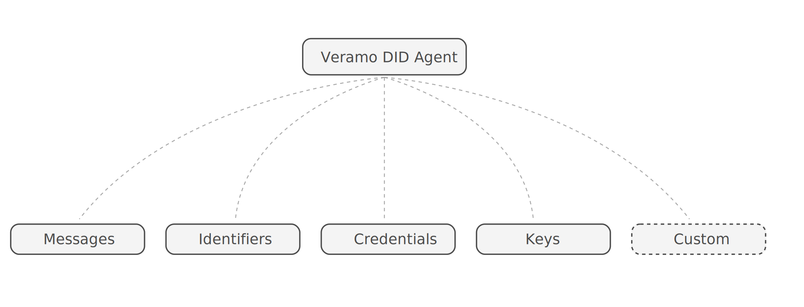

The **Veramo DID Agent** is the entry point into the Veramo framework. A Veramo Agent is an implementation of an **
Agent** using a plugin architecture. This architecture allows Veramo to be modular, scale well and play nicely with the
vast array of standards in the verifiable data space. Veramo is opinionated when it comes to standards compliance but
not when it comes to how you build your application layers.



Veramo Agent is responsibe for but not limited to:

- Creating Identifiers
- Resolving Identifiers
- Credential Issuance
- Credential Revocation
- Credential Exchange
- Secret Application Hot Sauce

On it's own the Veramo Agent provides a common interface for plugins to expand it's functionality. The Agent is the main
class and when instantiated, orchestrates both core and custom plugins and manages the core event system.

Veramo was written in TypeScript so it runs natively in Node, Browsers and React Native. Some plugins may be platform
specific and have platform alternatives. [TypeScript](https://www.typescriptlang.org/) is a very accessible and easy
language for most developers to get started quickly building on Veramo.

Methods defined in plugins are available on the agent instance eg:

```javascript
const message = await agent.handleMessage({
  raw: 'thwrthrtrtnwrtnwertetnrth.qaerthq.erth.erth.eTR.Heth',
})
```
